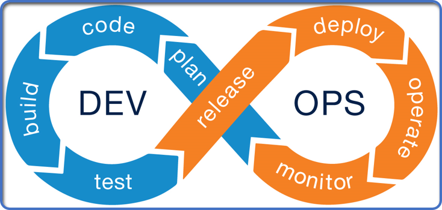
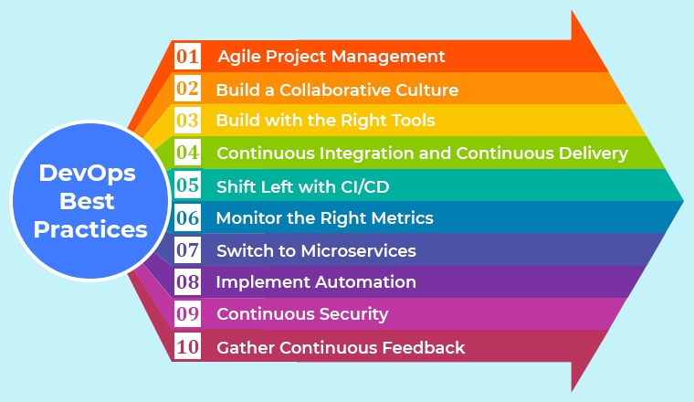

# Tech 201 DevOps

## What is DevOps

DevOps is the combination of cultural philosophies, practices, and tools that increases an organization's ability to deliver applications and services at high velocity. This allows organizations to improve products at a faster pace than organizations using traditional software development and infrastructure processes.

## What are the benefits of DevOps?
### Speed
By moving at high velocity businesses can innovate for the customer faster, adapt to changing markets better, and grow more efficient at driving business results.
### Rapid Delivery
Increase the frequency and pace of releases, so you can improve your product faster. The quicker you can release new features and fix errors, the faster you can respond to your customers' needs and build a competitive advantage.
### Reliability
Ensue the quality of application updates, so you can reliably deliver at a more rapid pace while maintaining a positive experience for the customer.
### Improved collaboration
Build more effective teams under a DevOps cultural model. Developers and operations teams collaborate closely and share many responsibilities. Teams are no longer 'siloed' and working together is made a high priority!
## DevOps Best Practices

### Agile Project Management
Agile project management allows companies to deliver high quality products quickly through applying the values of Agile to their product development processes. One of the most proven and popular frameworks to implement Agile is Scrum which takes and iterative and incremental approach to software development supported by its three pillars: transparency, inspection and adaptation. This adds value in the software development process by delivering to clients faster with fewer problems.
### Build a Collaborative Culture
By using the DevOps approach businesses are inviting more collaboration and transparency among its teams and systems. This helps removes silos between teams such as development and operations. As a result companies are able to develop their products faster and deliver them quickly to customers.
### Build with the Right Tools
A good DevOps methodology relies heavily on automation. Automating the process means you are holistically automating desigining, testing, and delivering software that makes life easier for bother developers and operations engineers.
### Continuous Integration and Continuous Delivery
